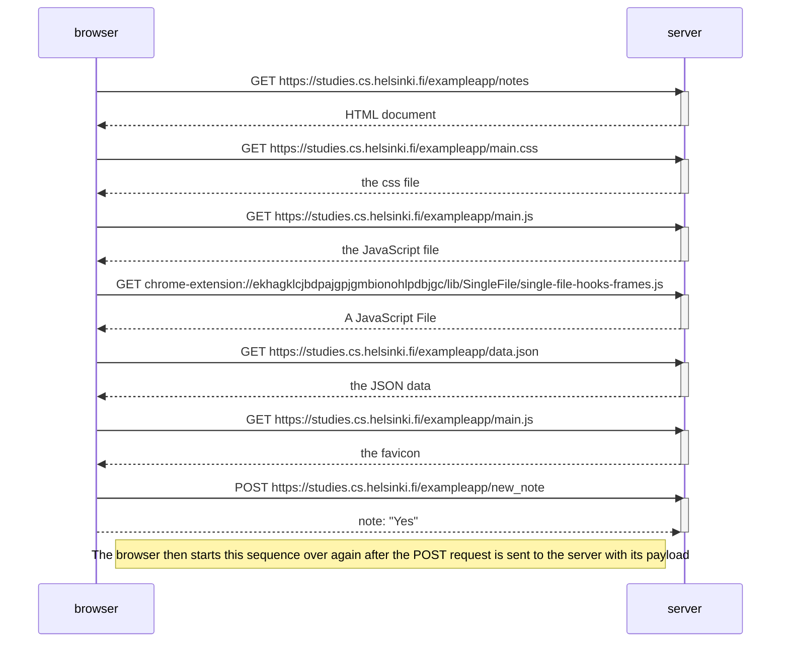

```mermaid
sequenceDiagram
    participant browser
    participant server
    


    browser->>server: GET https://studies.cs.helsinki.fi/exampleapp/notes
    activate server
    server-->>browser: HTML document
    deactivate server

    browser->>server: GET https://studies.cs.helsinki.fi/exampleapp/main.css
    activate server
    server-->>browser: the css file
    deactivate server

    browser->>server: GET https://studies.cs.helsinki.fi/exampleapp/main.js
    activate server
    server-->>browser: the JavaScript file
    deactivate server
    
    browser->>server: GET chrome-extension://ekhagklcjbdpajgpjgmbionohlpdbjgc/lib/SingleFile/single-file-hooks-frames.js
    activate server
    server-->>browser: A JavaScript File
    deactivate server
    
    browser->>server: GET https://studies.cs.helsinki.fi/exampleapp/data.json
    activate server
    server-->>browser: the JSON data
    deactivate server
    
    browser->>server: GET https://studies.cs.helsinki.fi/exampleapp/main.js
    activate server
    server-->>browser: the favicon
    deactivate server

    browser->>server: POST https://studies.cs.helsinki.fi/exampleapp/new_note
    activate server
    browser-->>server: note: "Yes"
    deactivate server
    
    Note right of browser: The browser then starts this sequence over again after the POST request is sent to the server with its payload
```
